# PyLadies Remote Simulation Exercise

# Table of Contents

- [GitHub Classroom](#github-classroom)
- [Submitting a Shared Repository Pull Request](#submitting-a-shared-repository-pull-request)
- [Reviewing Shared Repository Pull Request Locally- Example Process](#example-process)
- [Forking and Submitting a Forked Repository Pull Request](#forking-and-submitting-a-forked-repository-pull-request)
- [Reviewing Forked Repository Pull Request Locally- Example Process](#example-process)
- [Other Ideas](#other-ideas)
 
:top: <sub>[**back to top**](#table-of-contents)</sub>

<hr>

## GitHub Classroom


I will give you a link which will open a page where you can click "Accept the assignment". You might need to be logged into GitHub to proceed. 


A new page will open with a link at the bottom to click on to go to your repo


In the organization account will be a repo similar to mine (pyladies-remote-KatherineMichel), with your username. You will have "admin" privileges to this repo. 


:top: <sub>[**back to top**](#table-of-contents)</sub>

<hr>

## Submitting a Shared Repository Pull Request

I will have already created a branch with an added file (arbitrary change to demonstrate what happens) to get you started. Normally, someone will have submitted a pull request to you, but GitHub Classroom will not allow a pull request to be transferred to a new repo. There should be a message verifying that the branch exists and suggesting that a pull request be submitted.


Click "Compare and pull request" to start the pull request process. Verify the info is correct and click "Create pull request"


In the pull request tab, you can see the pull request

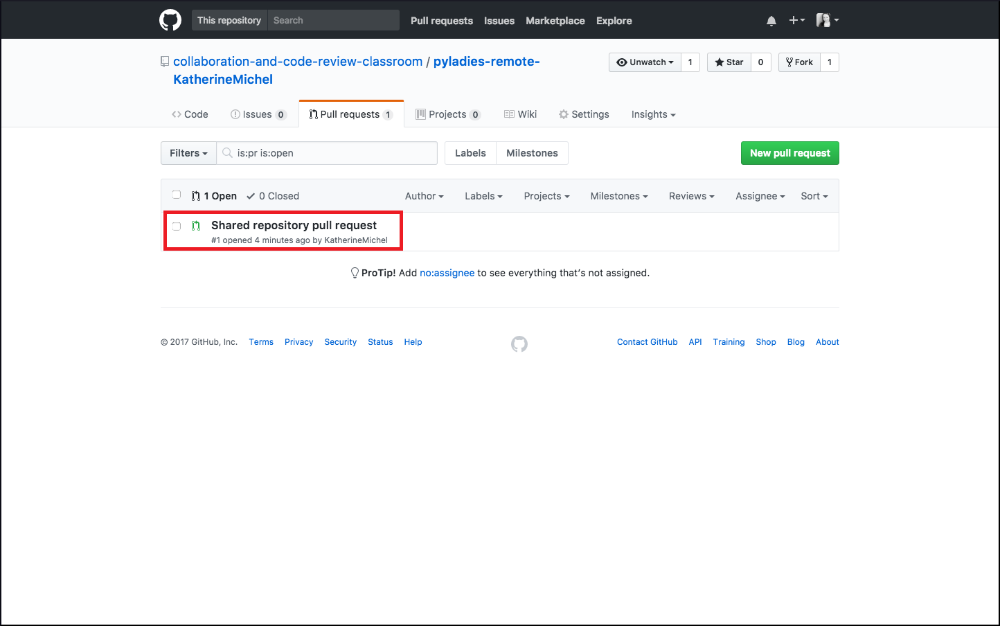

Click on the pull request to see info about the pull request. There is a "Merge pull request" button and command line instructions.

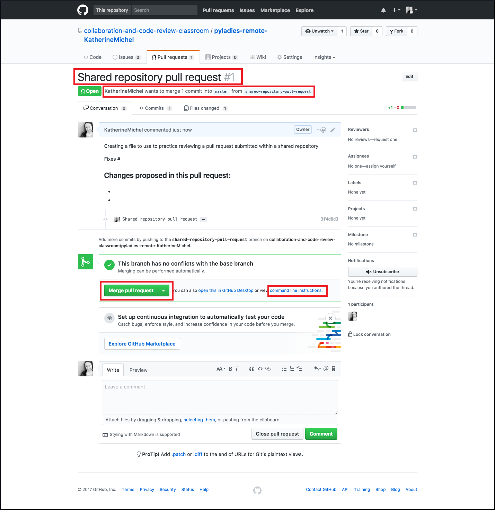

If you click on "command line instructions", the instructions for reviewing the pull request locally will appear.


If you want to look at the branch, you can by clicking on the branch and choosing the branch "shared-repository-pull-request"


You can see that the branch is ahead of master by one commit and you can see the file I have added.

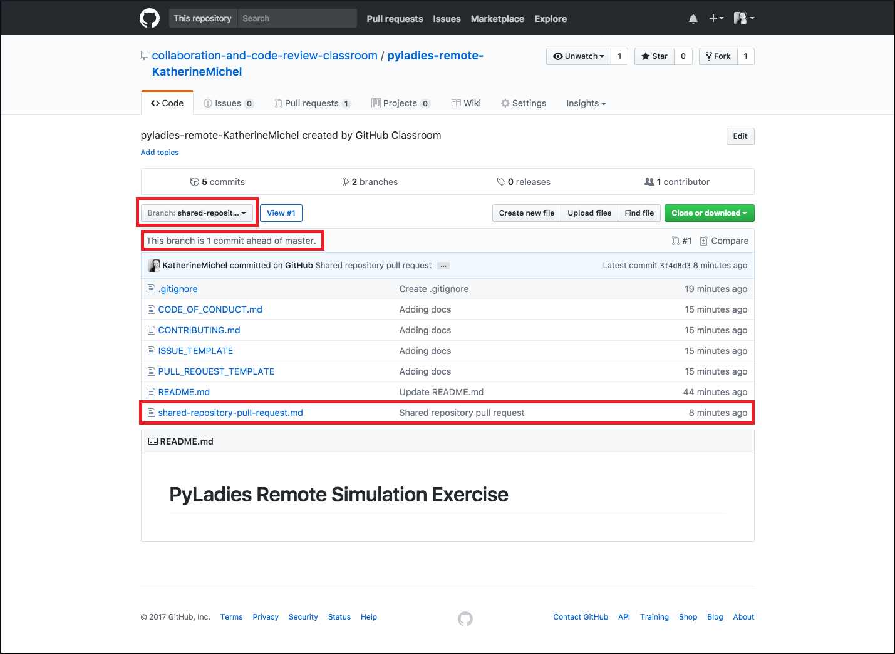

:top: <sub>[**back to top**](#table-of-contents)</sub>

<hr>

### Reviewing Shared Repository Pull Request Locally- Example Process

```bash
$ git clone https://github.com/collaboration-and-code-review-classroom/pyladies-remote-KatherineMichel
$ cd pyladies-remote-KatherineMichel

git fetch origin
git checkout -b shared-repository-pull-request origin/shared-repository-pull-request
git merge master
```

```bash
$ git add .
$ git commit -m "Your note"
$ git push origin shared-repository-pull-request
```

```bash
$ git checkout master
$ git merge --no-ff shared-repository-pull-request
$ git push origin master
```

:top: <sub>[**back to top**](#table-of-contents)</sub>

<hr>

- [Reviewing Forked Repository Pull Request Locally- Example Process](#example-process)

## Forking and Submitting a Forked Repository Pull Request

<!--
images/github-forked-repo-master-branch-after-new-branch.png
 -->
 
This is the master branch of your repo in the "Collaboration and Code Review Classroom" organization. To fork the repo, click the "Fork" button.
 
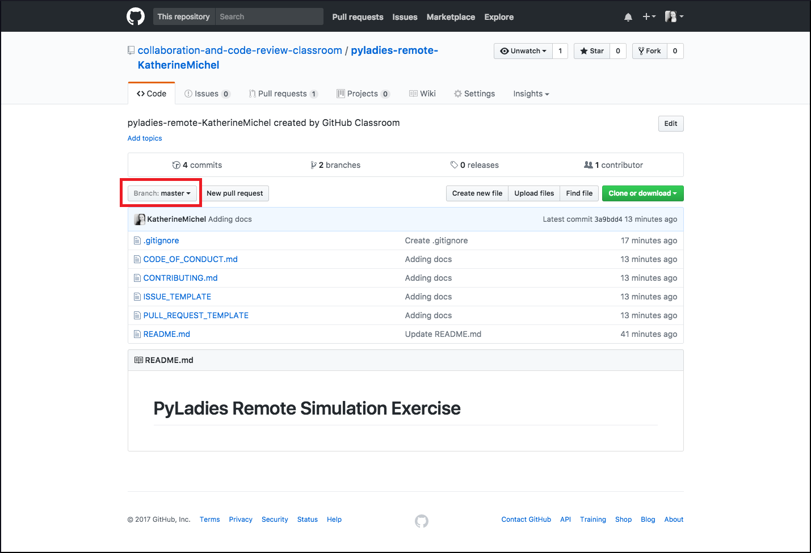

If you are a member of more than one user account or organization, you will be asked where to fork the repo. I am forking into my own user account.


You will see a message verifying that the repo is being forked.


You will now see an entry for the fork in your user account. Click on the repo hyperlink to open it. 

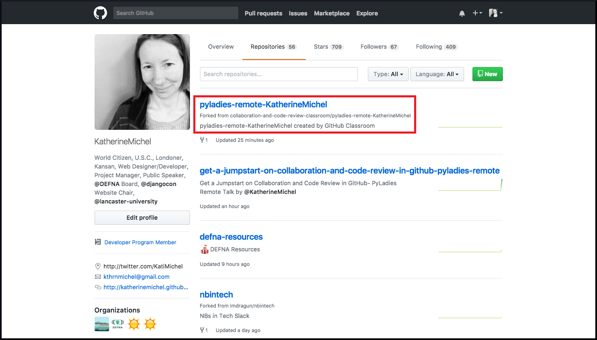

You will be on the master branch. The repo will be an exact copy of the organization repo. Click the pencil icon "Create new file" to open a new file. 

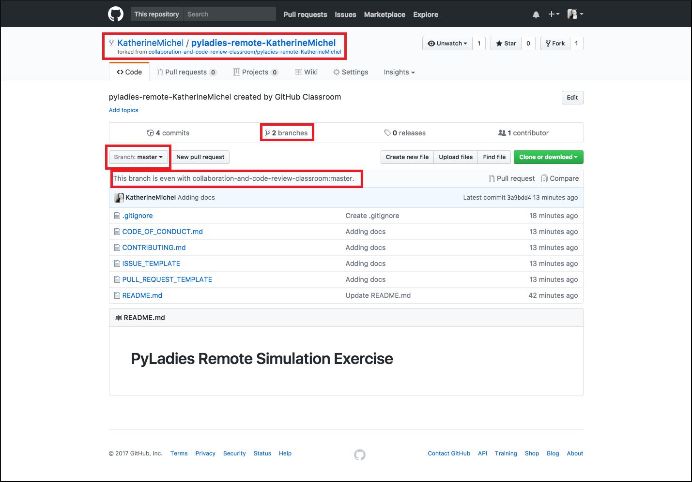

Create a new file, similarly to the new file in your organization repo. Or make some other change. 

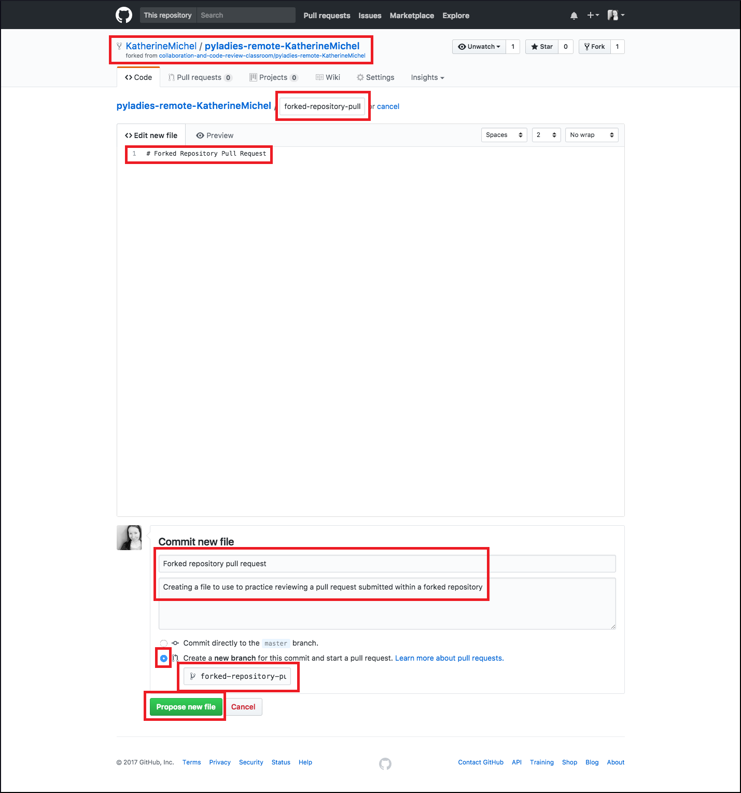

If you want to look at the branch, you can by clicking on the branch and choosing the name you gave the branch

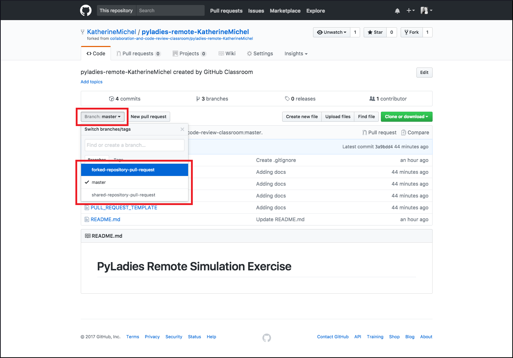

You can see that the branch is ahead of master by one commit and you can see the file I have added.

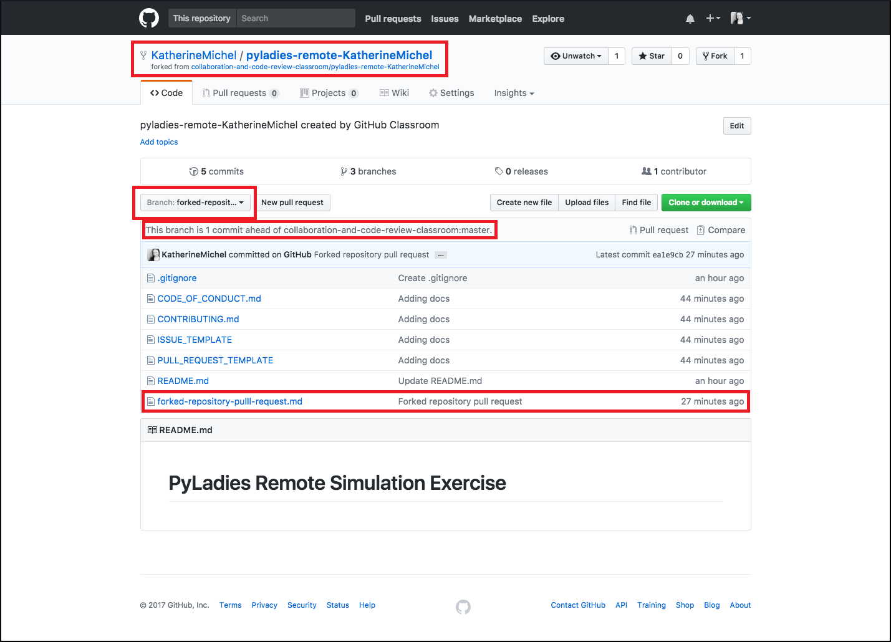

Go back to your organization repo, the place that you want your pull request to be submitted to. There should be a message verifying that the branch exists and suggesting that a pull request be submitted.

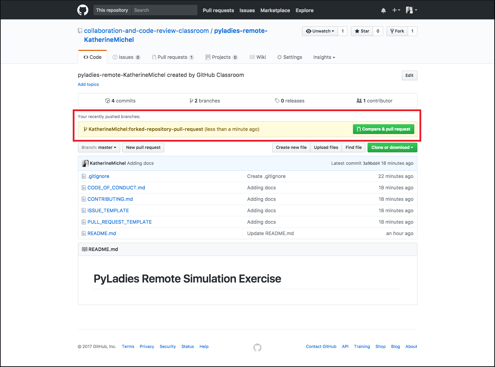

Click "Compare and pull request" to start the pull request process. Verify the info is correct and click "Create pull request"

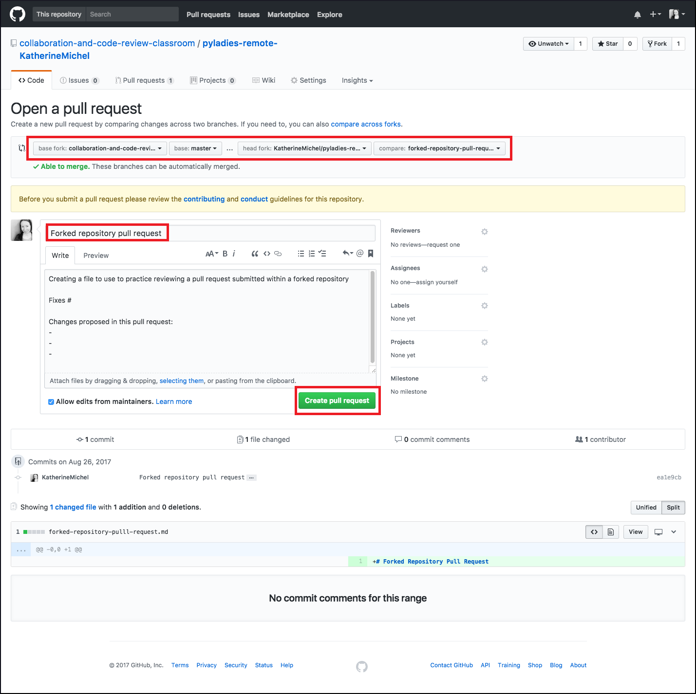

In the pull request tab, you can see the pull requests


Click on the pull request to see info about the pull request. There is a "Merge pull request" button and command line instructions.

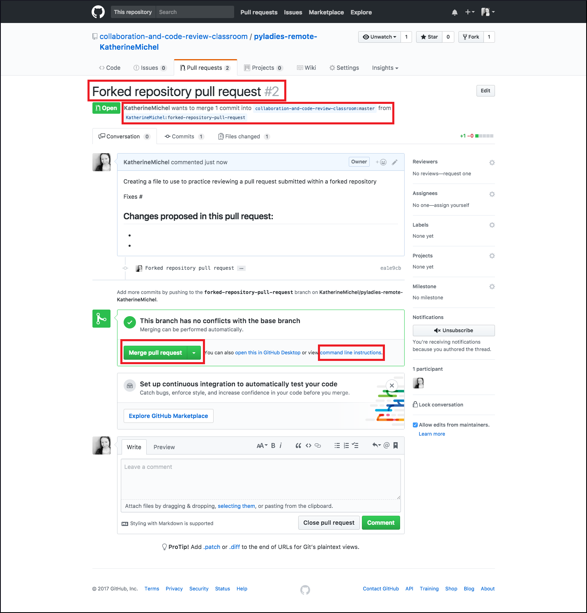

If you click on "command line instructions", the instructions for reviewing the pull request locally will appear.

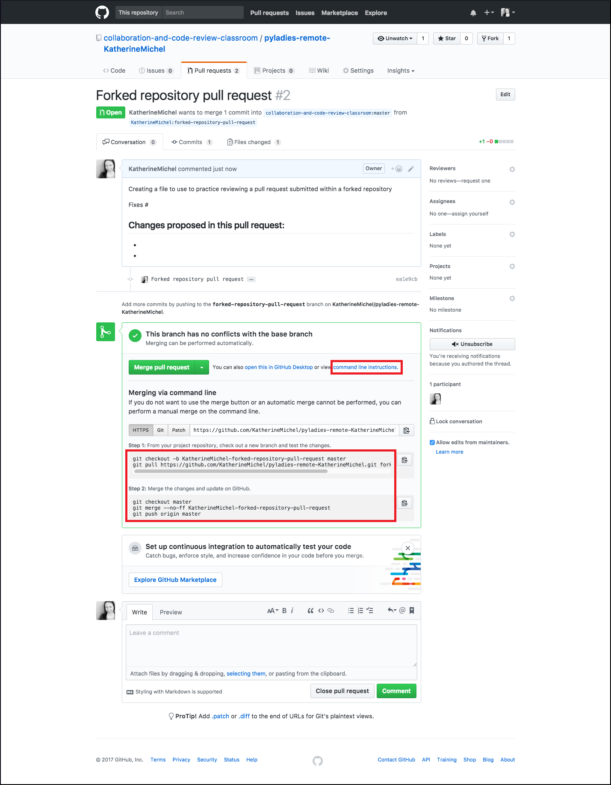

:top: <sub>[**back to top**](#table-of-contents)</sub>

<hr>

### Reviewing Forked Repository Pull Request Locally- Example Process

```bash
$ git clone https://github.com/collaboration-and-code-review-classroom/pyladies-remote-KatherineMichel
$ cd pyladies-remote-KatherineMichel
$ git checkout -b KatherineMichel-forked-repository-pull-request master
$ git pull https://github.com/KatherineMichel/pyladies-remote-KatherineMichel.git forked-repository-pull-request
```

```bash
$ git add .
$ git commit -m "Your note"
$ git push https://github.com/KatherineMichel/pyladies-remote-KatherineMichel KatherineMichel-forked-repository-pull-request:forked-repository-pull-request
```

```bash
$ git checkout master
$ git merge --no-ff KatherineMichel-forked-repository-pull-request
$ git push origin master
```

:top: <sub>[**back to top**](#table-of-contents)</sub>

<hr>

## Other Ideas

* Clone the shared repo, create a new branch locally, push to the shared repo, submit a pull request
* Clone the forked repo, create a new branch locally, push to the forked repo, submit a pull request to the shared repo
* Add a remote upstream to a forked repo clone locally, update the clone, and push the update to the fork on GitHub

:top: <sub>[**back to top**](#table-of-contents)</sub>

<hr>
